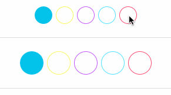

# react-native-theme-picker

A useful control that lets a user select color themes. Good for
use cases where there isn't an overload of colors.




## Quick start

```
$ npm i -S react-native-theme-picker
```

And use within components:

```javascript

<ThemePicker 
  colors={themes.map(theme=>theme.background)} 
  selectedColor={this.state.background} 
  onSelected={(color)=>this._selectColor(color)}/>


// with a different size
<ThemePicker 
  size={30}
  colors={themes.map(theme=>theme.background)} 
  selectedColor={this.state.background} 
  onSelected={(color)=>this._selectColor(color)}/>

// with a different style
<ThemePicker 
  holderStyle={{flexDirection:'column'}}
  selectorStyle={{borderWidth:3}}
  colors={themes.map(theme=>theme.background)} 
  selectedColor={this.state.background} 
  onSelected={(color)=>this._selectColor(color)}/>
```

Then to get a cute fill animation, try using `LayoutAnimation` with
these settings for animation:

```javascript
const animations ={
      duration: 100,
      create: {
        type: LayoutAnimation.Types.linear,
      },
      update: {
        type: LayoutAnimation.Types.linear,
        springDamping: 0.7,
      },
}
```

In your callback (`onSelected`) make sure to call `LayoutAnimation.configureNext(animations)` to
signal that you want these.


# Contributing

Fork, implement, add tests, pull request, get my everlasting thanks and a respectable place here :).

# Copyright

Copyright (c) 2016 [Dotan Nahum](http://gplus.to/dotan) [@jondot](http://twitter.com/jondot). See [LICENSE](LICENSE.txt) for further details.

